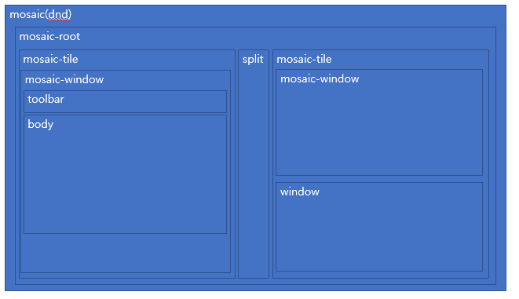

# 컴포넌트 구성
{: width="500" height="500"}
 
# 컴포넌트 분석
## 1. Mosaic 역할
  - 모자이크 모듈의 최상위 컴포넌트. 다른 컴포넌트를 이용해 모자이크를 구성함
  - react-dnd 모듈을 이용해 dnd 처리

## 2. MosaicRoot

## 3. MosaicTile

## 4. Split

## 5. MosaicWindow

